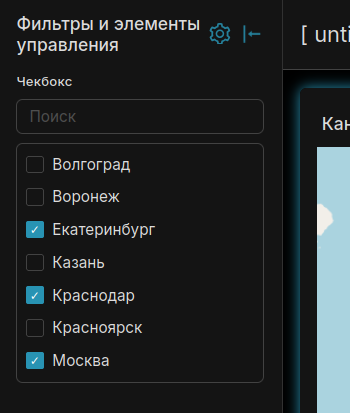

# Checkbox — Native Filter for Apache Superset
---

### [🇷🇺 Русский](README.ru.md) | 🇬🇧 English

---

> **A custom Apache Superset Native Filter plugin** that shows a scrollable
> **checkbox list** for filtering dashboards by column values
> (multi-select or single-select).

---

<div style="text-align: center;">
  
</div>

---

## Features

- Native Filter (dashboard filter bar), not a chart
- Scrollable checkbox list (not a dropdown)
- Multi-select by default; optional single-select in filter settings
- Optional search bar above the list
- Inverse selection («Select opposite values»): checked items show **×** and are excluded (`NOT IN`)
- **Displayed values** whitelist in filter settings (empty = all unique values)
- Default selected values via the standard native-filter Default value UI
- Option list does **not** cascade from other filters
- Filters charts on the same dataset through native filter scope
- Syncs selection from any **chart cross-filter** on the same dataset:
  resolves distinct values of the filter column under the chart’s filter
  clauses (any columns), then selects them
  (inverse → selects the complement so clicked values stay unmarked)

---

## Requirements

| Component | Version |
|-----------|---------|
| Apache Superset | 6.1.0 |
| Python | 3.10+ |
| Node.js | 20+ (image build: 22) |
| npm | 10+ |
| React (peer) | ^17.0.2 |
| npm package | `@superset-ui/plugin-filter-checkbox` |
| Plugin key | `filter_checkbox` |

---

## Installation

### Step 1. Clone Apache Superset (target version)

[Apache Superset 6.1.0](https://github.com/apache/superset/releases/tag/6.1.0)

```bash
git clone https://github.com/apache/superset.git -b 6.1.0;
```

### Step 2. Clone the plugin repository

```bash
git clone https://github.com/Kami-sama322/superset-plugin-filter-checkbox.git;
```

### Step 3. Run the auto-installation script

```bash
chmod +x superset-plugin-filter-checkbox/install.sh;
./superset-plugin-filter-checkbox/install.sh ./superset;
```

> `./superset` — root of the Superset tree from Step 1. The script installs
> the plugin as a **standalone npm package** into
> `superset-frontend/plugins/plugin-filter-checkbox/` and registers it at
> Superset extension points (`key: filter_checkbox`).

#### What the script does:

| Action | File |
|--------|------|
| 0. Installs the plugin package | `superset-frontend/plugins/plugin-filter-checkbox/` |
| 1. Registers the plugin | `superset-frontend/src/setup/setupPluginsExtra.ts` |
| 2. Adds a tsconfig path alias | `superset-frontend/tsconfig.json` |
| 3. Adds `filter_checkbox` to `FILTER_SUPPORTED_TYPES` | `FiltersConfigForm/constants.ts` |
| 4. Adds **Displayed values** field under Description | `FiltersConfigForm` + `DisplayValuesField.tsx` |

> The «Add filter» dropdown is built from the plugin registry
> (`Behavior.NativeFilter`). `setupPluginsExtra.ts` is the documented
> extension point for custom plugins. `FILTER_SUPPORTED_TYPES` controls
> which column types appear in the column picker.
>
> **If the script fails** — apply the changes manually (Step 4b below).

---

### Step 4b. Manual plugin registration (if install.sh fails)

#### 1. Copy the package into the plugins folder

```bash
mkdir -p superset-frontend/plugins/plugin-filter-checkbox/src
cp -r superset-plugin-filter-checkbox/src/. \
  superset-frontend/plugins/plugin-filter-checkbox/src/
cp superset-plugin-filter-checkbox/package.json \
  superset-frontend/plugins/plugin-filter-checkbox/package.json
cp superset-plugin-filter-checkbox/tsconfig.json \
  superset-frontend/plugins/plugin-filter-checkbox/tsconfig.json
```

#### 2. Register in `superset-frontend/src/setup/setupPluginsExtra.ts`

```typescript
import CheckboxFilterPlugin from '@superset-ui/plugin-filter-checkbox';

export default function setupPluginsExtra() {
  new CheckboxFilterPlugin()
    .configure({ key: 'filter_checkbox' })
    .register();
}
```

#### 3. Add a tsconfig path alias — `superset-frontend/tsconfig.json`

In the `paths` block:

```json
"@superset-ui/plugin-filter-checkbox": ["./plugins/plugin-filter-checkbox/src"],
```

#### 4. Allow column types — `FiltersConfigForm/constants.ts`

In `FILTER_SUPPORTED_TYPES`:

```typescript
filter_checkbox: [
  GenericDataType.Boolean,
  GenericDataType.String,
  GenericDataType.Numeric,
  GenericDataType.Temporal,
],
```

#### 5. Displayed values UI (optional but recommended)

Copy `superset-patches/DisplayValuesField.tsx` into
`FiltersConfigForm/DisplayValuesField.tsx` and wire it under Description
in `FiltersConfigForm.tsx` the same way `install.sh` does.

Then run `npm install` and `npm run dev-server` in `superset-frontend`.

---

## Deploy Superset in DEV mode

### Step 5. Python environment

```bash
cd superset
python -m venv .venv
source .venv/bin/activate
pip install -r requirements/development.txt
```

### Step 6. Configuration (optional)

Native filters and cross-filtering are enabled by default in Superset 6.1.0.
If you customize feature flags, keep at least:

```python
FEATURE_FLAGS = {
    "DASHBOARD_NATIVE_FILTERS": True,
    "DASHBOARD_CROSS_FILTERING": True,
}
```

### Step 7–10. Database and admin

```bash
superset db upgrade
superset fab create-admin \
  --username admin --firstname Admin --lastname User \
  --email admin@example.com --password admin
superset init
```

### Step 11–13. Backend and frontend

```bash
# terminal 1 — backend
superset run -h 0.0.0.0 -p 8088 --with-threads --reload --debugger

# terminal 2 — frontend (after install.sh + npm install in superset-frontend)
cd superset-frontend
npm install
npm run dev-server
```

---

## Quick start with Docker

This repo ships a self-contained stack: `Dockerfile` builds Superset **6.1.0**
with the plugin baked in; `docker-compose.yml` runs it locally.

**Requirements:** Docker, Docker Compose v2, ~8 GB RAM for the frontend build.

```bash
git clone https://github.com/Kami-sama322/superset-plugin-filter-checkbox.git
cd superset-plugin-filter-checkbox

docker compose build    # first run: clones Superset 6.1.0 + npm run build (15–40 min)
docker compose up -d    # init DB, admin admin/admin, load-examples on first start
```

Open **http://localhost:8088** → login **admin** / **admin**.

On first start the container runs `superset db upgrade`, creates the admin user,
and loads example datasets (1–3 minutes). Later starts skip init if the volume
exists.

**Reset environment** (fresh DB and examples):

```bash
docker compose down -v
docker compose up -d
```

**Verify the plugin:** Dashboard → Edit → **+ Add / Edit filters** →
**Checkbox**.

---

## How to use the filter

1. Open a dashboard → **Edit** → **+ Add / Edit filters**
2. Add filter → choose **Checkbox**
3. Select a **Column**
4. Optional settings:
   - **Can select multiple values** (uncheck for single select)
   - **Show search bar**
   - **Inverse selection** / Select opposite values
   - **Filter value is required**
   - **Sort filter values**
5. In **Settings**:
   - **Displayed values** (under Description) — whitelist; empty = show all
   - Optional: enable **Filter has default value** and pick defaults
6. Set filter **scope** to the charts that should react
7. **Save**

### Cross-filter sync

When a chart on the **same dataset** emits a cross-filter (table cell click,
map region click, …), the checkbox list updates to the distinct values of
**this filter’s column** that remain under that chart filter — even if the
chart filtered a different column.

- Normal mode: matching values are checked (✓)
- Inverse mode: matching values stay unchecked; all others get ×

### Example

Dataset columns: `macroregion`, `region` (many regions per macroregion).

| Filter column | Chart click | Checkbox result (normal) |
|---------------|-------------|---------------------------|
| `region` | table/map on `macroregion` | regions belonging to that macroregion |
| `region` | table on `region` | that region |

---

## Package layout

```
superset-plugin-filter-checkbox/
├── README.md
├── README.ru.md
├── src/
│   ├── index.ts
│   ├── CheckboxFilterPlugin.tsx
│   ├── useCrossFilterSync.ts   # Redux + resolve chart → filter
│   ├── crossFilterSync.ts      # collect / fetch / selection helpers
│   ├── buildQuery.ts
│   ├── controlPanel.ts
│   ├── transformProps.ts
│   ├── types.ts
│   ├── utils.ts
│   ├── common.ts
│   └── images/thumbnail.png
├── superset-patches/
│   └── DisplayValuesField.tsx  # copied into FiltersConfigForm by install.sh
├── package.json
├── tsconfig.json
├── install.sh
├── Dockerfile                  # Superset 6.1.0 + plugin production build
└── docker-compose.yml          # Local demo stack
```

---

## License

Apache License 2.0 (same as Superset)
